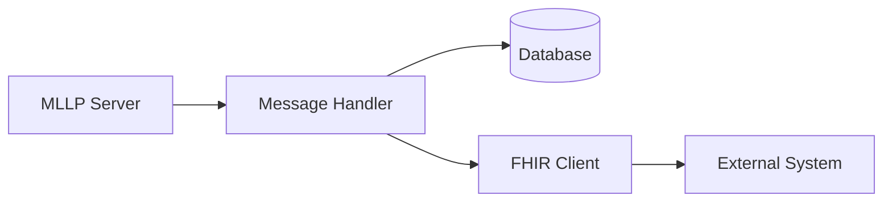
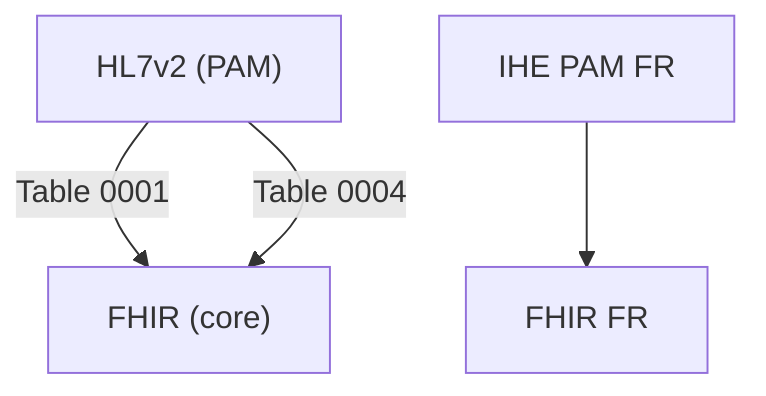

# MedData Bridge

Application FastAPI pour l'interopérabilité HL7v2 (MLLP) et FHIR dans le contexte français.

## Installation

```bash
# Créer un environnement virtuel
python -m venv .venv

# Activer l'environnement
source .venv/bin/activate  # Linux/Mac
.venv\Scripts\activate     # Windows

# Installer les dépendances
pip install -r requirements.txt
```

## Configuration

L'application utilise des variables d'environnement pour sa configuration :

| Variable | Description | Valeurs | Par défaut |
|----------|-------------|---------|------------|
| TESTING | Mode test (pas d'init DB ni serveurs MLLP) | 0, 1, true, True | 0 |
| INIT_VOCAB | Initialiser les vocabulaires au démarrage | 0, 1, true, True | 0 |
| MLLP_TRACE | Logs MLLP détaillés | 0, 1, true, True | 0 |
| SSL_CERT_FILE | Certificat CA pour FHIR | chemin fichier | None |
| REQUESTS_CA_BUNDLE | Bundle CA pour FHIR | chemin fichier | None |

## Démarrage

### Développement

```bash
# Démarrer avec rechargement auto
PYTHONPATH=. .venv/bin/python -m uvicorn app.app:app --reload

# Démarrer avec initialisation des vocabulaires
INIT_VOCAB=1 PYTHONPATH=. .venv/bin/python -m uvicorn app.app:app --reload

# Démarrer avec logs MLLP détaillés
MLLP_TRACE=1 PYTHONPATH=. .venv/bin/python -m uvicorn app.app:app --reload

# Tout combiner
INIT_VOCAB=1 MLLP_TRACE=1 PYTHONPATH=. .venv/bin/python -m uvicorn app.app:app --reload --debug
```

### Production

En production, utilisez gunicorn avec des workers uvicorn :

```bash
PYTHONPATH=. .venv/bin/python -m gunicorn app.app:app -k uvicorn.workers.UvicornWorker -w 4
```

## Outils et Scripts

### Initialisation des données

```bash
# Initialiser/mettre à jour les vocabulaires
./tools/init_vocabularies.py

# Inspecter la base de données
python tools/inspect_db.py

# Envoyer un message HL7 de test
python tools/post_hl7.py <fichier_hl7> <endpoint_id>
```

## Architecture

### Points d'entrée

- FastAPI : `app/app.py` via `app.create_app()`
- UI Admin : montée automatiquement sur `/admin`
- API FHIR : routes dans `app/routers/fhir_*`
- API HL7v2 : points MLLP configurés via `/interop/mllp/*`

### Composants clés

1. **Base de données**
   - SQLModel/SQLite via `app/db.py`
   - Modèles dans `app/models*.py`
   - Sessions via `Depends(get_session)`

2. **Transport HL7v2 (MLLP)**
   - Manager : `app/services/mllp_manager.py`
   - Protocol : `app/services/mllp.py`
   - Handler entrant : `app/services/transport_inbound.py`

3. **Transport FHIR**
   - Client : `app/services/fhir_transport.py`
   - Mapping : `app/services/fhir.py`

4. **Vocabulaires**
   - Init : `app/vocabulary_init.py`
   - FHIR FR : `app/services/vocabulary_fhir_fr.py`
   - IHE FR : `app/services/vocabulary_ihe_fr.py`
   - HL7v2 : `app/services/vocabulary_loader.py`

### Flux de données



## Tests

```bash
# Tests complets
PYTHONPATH=. .venv/bin/python -m pytest

# Tests ciblés
PYTHONPATH=. .venv/bin/python -m pytest tests/test_ui_pages.py -v
PYTHONPATH=. .venv/bin/python -m pytest tests/test_form_smoke.py::test_create_ght_via_form -v

# Tests avec couverture
PYTHONPATH=. .venv/bin/python -m pytest --cov=app tests/
```

## Vocabulaires et Interopérabilité

### Systèmes de vocabulaires

1. **FHIR International**
   - Administrative Gender
   - Encounter Status/Class
   - Location Type

2. **FHIR France**
   - Spécialités (R38)
   - Types d'organisations (R02)
   - Types de lieux (R67/R68)
   - Contacts patient (R260)
   - Modes d'hospitalisation (R306/R307)

3. **HL7v2 Standard**
   - Patient Class (0004)
   - Admission Type (0007)
   - Administrative Sex (0001)

4. **IHE PAM France**
   - Types de patient
   - Types d'UF
   - Types de mouvements

### Mappings

Les vocabulaires sont mappés entre eux pour l'interopérabilité :



## Utilisation courante

### 1. Configuration initiale

```bash
# 1. Initialiser la base et les vocabulaires
./tools/init_vocabularies.py

# 2. Démarrer l'application
PYTHONPATH=. .venv/bin/python -m uvicorn app.app:app --reload
```

### 2. Points MLLP

1. Créer via l'UI (`/admin/endpoints/new`)
2. Configurer port/host/options
3. Démarrer via `/interop/mllp/start/{id}`

Note: pour certains récepteurs, il est nécessaire de forcer l'espace de noms (namespace) ou l'OID
utilisé dans les identifiants émis (PID-3 CX pour HL7 ou `identifier.system` pour FHIR). Le modèle
`SystemEndpoint` expose deux champs optionnels que vous pouvez renseigner via l'UI d'admin :

- `forced_identifier_system` : URI ou chaîne à placer dans `identifier.system` (ex: `urn:oid:1.2.3`)
- `forced_identifier_oid` : OID à placer comme assigning authority / assigner (ex: `1.2.250.1.71.1.2.2`)

Quand ces champs sont renseignés pour un endpoint, l'application :
- Pour HL7/MLLP : construit le composant PID-3 CX comme `value^^^{assigningAuthority}^{PI}` où
   `assigningAuthority` est `forced_identifier_oid` (si présent) sinon `forced_identifier_system`.
- Pour FHIR : applique `forced_identifier_system` à tout identifiant sans `system` et ajoute un
   champ `assigner.identifier.value` avec la valeur `forced_identifier_oid` si fourni.

Cela vous permet d'adapter dynamiquement le namespace/OID attendu par le logiciel récepteur sans
modifier les données source.

### 3. Points FHIR

1. Créer via l'UI
2. Configurer URL/auth/certificats
3. Tester via `/admin/endpoints/{id}/test`

## Dépannage

### Logs MLLP

```bash
# Activer traces MLLP
export MLLP_TRACE=1
# Ou au démarrage
MLLP_TRACE=1 PYTHONPATH=. .venv/bin/python -m uvicorn app.app:app
```

### Base de données

```bash
# Sauvegarder
cp poc.db poc.db.bak

# Réinitialiser
rm poc.db
./tools/init_vocabularies.py
```

Note: Certaines modifications de modèles (ajout de colonnes) ne sont pas appliquées automatiquement
sur une base SQLite existante. Si vous ajoutez/champ de modèle (ex: `forced_identifier_system`),
vous devrez soit recréer la base (`rm poc.db` puis relancer `./tools/init_vocabularies.py`),
soit effectuer une migration SQL manuelle.

### SSL/TLS

Pour les certificats d'entreprise :

```bash
# Option 1: Variable d'environnement
export SSL_CERT_FILE=/chemin/vers/ca.pem

# Option 2: Dans la configuration endpoint
/admin/endpoints/{id}/edit -> CA Certificate
```